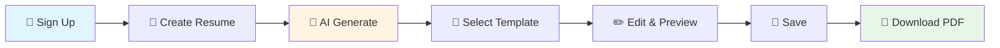

<div align="center">

# 🎯 AI-Powered Resume Builder

### *Create Professional Resumes in Minutes with AI*

[](https://nodejs.org/)
[](https://expressjs.com/)
[](https://www.mongodb.com/)
[](https://www.javascript.com/)


*A full-stack web application that leverages AI to generate professional, ATS-friendly resumes.*

[Getting Started](#-installation) • [Features](#-features) • [Tech Stack](#-tech-stack) • [API Docs](#-api-endpoints) • [Contributing](#-contributing)

---

</div>

## ✨ Features

<table>
<tr>
<td width="50%">

### 🔐 Authentication
- Secure JWT-based authentication
- Encrypted password storage
- Session management

### 🤖 AI Generation
- Smart content creation with Together API
- ATS-optimized content
- Professional language suggestions

</td>
<td width="50%">

### 🎨 Templates & Editing
- Multiple professional templates
- Live preview & real-time editing
- Drag & drop section management

### 💾 Save & Export
- Cloud storage in MongoDB
- High-quality PDF generation
- Manage multiple resume versions

</td>
</tr>
</table>

## 🛠 Tech Stack

<div align="center">

| Category | Technologies |
|----------|-------------|
| **Backend** |   |
| **Database** |   |
| **Authentication** |   |
| **AI & PDF** |   |
| **Frontend** |    |

</div>

## 🚀 Installation

### 📋 Prerequisites

```bash
✓ Node.js (v18 or higher)
✓ MongoDB (Local or Atlas)
✓ Together API Key
✓ Git
```

### ⚙️ Setup

1. **Clone the repository**
   ```bash
   git clone https://github.com/prv05/AI-Powered-Resume-Builder.git
   cd AI-Powered-Resume-Builder/backend
   ```

2. **Install dependencies**
   ```bash
   npm install
   ```

3. **Create `.env` file in backend directory**
   ```env
   PORT=5000
   MONGO_URI=your_mongodb_connection_string
   JWT_SECRET=your_jwt_secret_key
   TOGETHER_API_KEY=your_together_api_key
   ```

4. **Start MongoDB**
   ```bash
   # Windows
   net start MongoDB
   
   # Linux
   sudo systemctl start mongod
   
   # Mac
   brew services start mongodb-community
   ```

5. **Run the application**
   ```bash
   # Development mode
   npm run dev
   
   # Production mode
   npm start
   ```

6. **Open your browser**
   ```
   http://localhost:5000
   ```

## 📁 Project Structure

```
backend/
├── components/          # Reusable components
├── config/             # Database configuration
├── controllers/        # Route controllers
├── models/             # Mongoose models (User, Template)
├── public/             # Static files (CSS, images)
├── routes/             # API routes
├── services/           # Business logic
├── views/              # EJS templates
├── server.js           # Main application file
└── package.json        # Dependencies
```

## 📡 API Endpoints

<details>
<summary><b>🔐 Authentication Endpoints</b></summary>
<br>

| Method | Endpoint | Description |
|--------|----------|-------------|
| `POST` | `/api/auth/register` | Register new user |
| `POST` | `/api/auth/login` | User login |

</details>

<details>
<summary><b>📝 Resume Operations</b></summary>
<br>

| Method | Endpoint | Description |
|--------|----------|-------------|
| `POST` | `/generate-resume` | Generate resume with AI |
| `POST` | `/save-as-template` | Save resume template |
| `GET` | `/get-templates?username=<username>` | Get user's saved templates |
| `DELETE` | `/delete-template/:id` | Delete a template |
| `POST` | `/download-pdf` | Download resume as PDF |

</details>

## 💡 Usage

<div align="center">



</div>

### Step-by-Step Guide

| Step | Action | Description |
|------|--------|-------------|
| 1️⃣ | **Sign Up** | Create an account with email and password |
| 2️⃣ | **Login** | Access your personalized dashboard |
| 3️⃣ | **Create** | Fill in your details or use AI generation |
| 4️⃣ | **Choose** | Select from professional templates |
| 5️⃣ | **Edit** | Customize with live preview |
| 6️⃣ | **Save** | Store for future edits |
| 7️⃣ | **Export** | Download as high-quality PDF |

## 🔑 Environment Variables

| Variable | Description | Required | Default |
|----------|-------------|----------|--------|
| `PORT` | Server port number | ❌ | `5000` |
| `MONGO_URI` | MongoDB connection string | ✅ | - |
| `JWT_SECRET` | Secret key for JWT tokens | ✅ | - |
| `TOGETHER_API_KEY` | Together AI API key | ✅ | - |

---

## 🤝 Contributing

Contributions make the open-source community an amazing place to learn, inspire, and create. Any contributions you make are **greatly appreciated**!

<div align="center">

### How to Contribute?

</div>

```bash
# 1. Fork the Project
# 2. Clone your fork
git clone https://github.com/your-username/AI-Powered-Resume-Builder.git

# 3. Create your Feature Branch
git checkout -b feature/AmazingFeature

# 4. Commit your Changes
git commit -m 'Add some AmazingFeature'

# 5. Push to the Branch
git push origin feature/AmazingFeature

# 6. Open a Pull Request
```

<div align="center">

### 💡 Contribution Ideas

🎨 New Templates • 🌍 Internationalization • 📱 Mobile App • 🧪 Testing • 📚 Documentation

</div>

---

## 📞 Contact & Support

<div align="center">

**Project Maintainer:** [@prv05](https://github.com/prv05)

**Repository:** [github.com/prv05/AI-Powered-Resume-Builder](https://github.com/prv05/AI-Powered-Resume-Builder)

[](https://github.com/prv05/AI-Powered-Resume-Builder/issues)
[](https://github.com/prv05/AI-Powered-Resume-Builder/discussions)

</div>

---

## 🙏 Acknowledgments

<div align="center">

| Technology | Purpose |
|------------|--------|
| [**Together AI**](https://www.together.ai/) | 🤖 AI-powered content generation |
| [**MongoDB**](https://www.mongodb.com/) | 🗄️ Database solution |
| [**Express.js**](https://expressjs.com/) | 🚀 Web framework |
| [**Puppeteer**](https://pptr.dev/) | 📄 PDF generation |
| [**EJS**](https://ejs.co/) | 🎨 Template engine |

</div>

---

<div align="center">

### Made with ❤️ for developers worldwide

**If you found this project helpful, consider giving it a ⭐**

[⬆ Back to Top](#-ai-powered-resume-builder)

</div>
